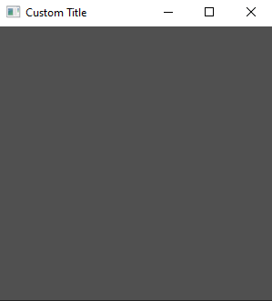

# Adding a Widget

We can add a simple widget to our application like so:

```rs
use tuix::*;

fn main() {
    let app = Application::new(|state, window| {
        
        window.set_title("Custom Title").set_inner_size(300,300);

        // Add an Element widget
        Element::new().build(state, window.entity(), |builder| builder);

    });

    app.run();
}
```
An `Element` widget is the simplest built-in widget that tuix has. It contains no data or event handling logic but can be styled like any other widget.

To add the element widget we first create a new instance with `Element::new()`, and then build the widget into the app with `.build(state, window.entity(), |builder| builder)`. 

- The first argument,`state`, is a mutable reference to `State` from the application closure. 

- The second argument is the entity id of the parent widget, in this case the window widget, which we get by calling `window.entity()`. Each widget has an `Entity` id which can be used to get and set various widget properties stored in `State`.

- The third argument is a closure which provides us with a builder we can use to set properties of the newly created widget.

However, if you build and run this code you will still see an empty window.



This is because the `Element` widget has no built-in styling. To see the element, we can add a width, height, and background color using the builder:

```rs
use tuix::*;

fn main() {
    let app = Application::new(|state, window| {
        
        window.set_title("Custom Title").set_inner_size(300,300);

        Element::new().build(state, window.entity(), |builder| 
            builder
                .set_width(Units::Pixels(100.0))
                .set_height(Units::Pixels(30.0))
                .set_background_color(Color::rgb(200,80,20))
        );

    });

    app.run();
}
```

This will produce a nice orange widget in the top left corner of the window with a width of 100 pixels and a height of 30 pixels. In the next section we will look at how to compose widgets together by adding a button to our element widget.

