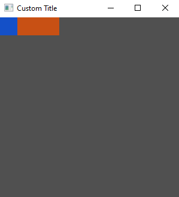

# Composing Widgets

To demonstrate the composition of widgets, let's add a `Button` widget to the `Element` widget we have from before:

```rs
use tuix::*;

fn main() {
    let app = Application::new(|state, window| {
        
        window.set_title("Custom Title").set_inner_size(300,300);

        let container = Element::new().build(state, window.entity(), |builder| 
            builder
                .set_width(Units::Pixels(100.0))
                .set_height(Units::Pixels(30.0))
                .set_background_color(Color::rgb(200,80,20))
        );

        // Add a Button widget as a child of the Element widget
        Button::new().build(state, container, |builder| 
            builder
                .set_width(Units::Pixels(30.0))
                .set_height(Units::Pixels(30.0))
                .set_background_color(Color::rgb(20,80,200))
        );

    });

    app.run();
}
```

Building the button widget works in the same way as the element widget. However, notice that the building of the element is now bound to a `container` variable. This is the `Entity` id of the element widget and is returned by the `.build(...)` function.

This id is then used to specify the element widget as the parent of the button widget in the button's `.build(...)` function. The button widget style properties are also different to the element widget to help distinguish them. 

Running this code produces:



Composing widgets forms a tree, where each widget has a single parent and zero or more children. In tuix this tree is called the `Hierarchy`, and can be found in `State`. This hierarchy is used to propagate events as well as to draw the elements in the correct order.

We will cover the `Hierarchy` in more detail when we start to handle events and custom drawing a little later. In the next section we'll cover the basics of widget layout.