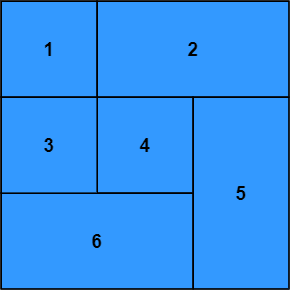

# Overview (Grid)

An overview of the layout system for working with grids, in which child elements are positioned by row and column indices and span one or more rows and columns.

1. A parent element can arrange its children into a grid (layout-type: grid).

2. The rows and columns of a grid can be expressed in pixels, percentage, stretch, or auto.

3. A child element specifies its position with a row index and column index.

4. A child element specifies its size by spanning a number of rows and columns.

5. 

<!-- - **Axis** - refers to either horizontal (row) or vertical (column) directions. Left and right apply to the horizontal axis while top and bottom apply to the vertical axis.
- **Stack** - elements arranged within a parent one after another along an axis.

## Units

All spacing and size properties use the same `Units` enum, which has four variants:

1. **Pixels** - specifies a length pixels
2. **Percentage** - specifies a length as a percentage of the parent length in the same axis (e.g. percentage `left` would be a perctange of the parent width)
3. **Stretch** - specifies the length as a proportion of the free space available.
4. **Auto** - specifies that the length should be automatically determined. This variant has different behaviour depending on the property. -->

