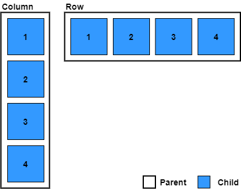
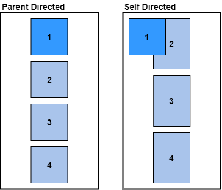
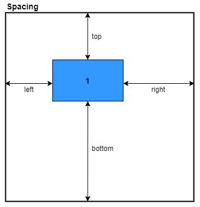
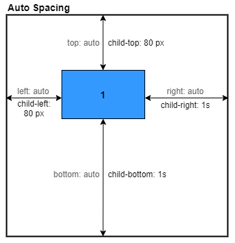
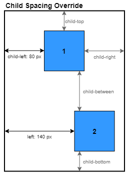

# Overview (Stack)

An overview of the layout system for working with stacks, in which child elements are positioned one after another.

1. For stacking, a parent element can arrange its children into a vertical stack (`layout-type: column`) or a horizontal stack (`layout-type: row`).

2. A child element is positioned relative to its stack position (`position-type: parent-directed`), or relative to the top-left of its parent (`position-type: self-directed`).

3. A child element can be positioned by adding space to the `left`, `right`, `top`, or `bottom` of an element.

4. Spacing can be expressed in pixels, percentage, stretch, or auto (see 8). Stretch causes the spacing to be flexible, occupying a proportion of the remaining free space. By default, spacing is set to auto.

5. The size of an element is determined by its `width` and `height`, which can also be expressed in pixels, percentage, stretch and auto. By default, size is set to stretch.

6. When size is set to auto, an element will 'hug' its children in that axis. This is also true for `min-width`/`min-height` (see 10).

7. A parent can add space around its stacked children with `child-space`, or specified individually with `child-left`, `child-right`, `child-top`, `child-bottom`, or add space between its child elements with `child-between`.

8. Child spacing applies to elements with spacing set to auto.

9. Spacing set in pixels, percentage, or stretch overrides child spacing.

10. All spacing and size properties have corresponding minimum and maximum constraint properties. For example, for `left` there is `min-left` and `max-left`. By default spacing and size minimums and maximums are set to auto. This will cause elements to `hug` their children if the size if flexible and goes below the minimum.

