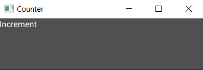
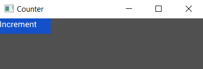

# Adding a Widget

For our counter we know we're going to need two buttons (for increment and decrement) and at least one label (to show the value). But to strt with let's add just one of the buttons to our window:

```rust
extern crate tuix;
use tuix::*;

fn main() {
    let window_description = WindowDescription::new()
        .with_title("Counter")
        .with_inner_size(400, 100);
    let app = Application::new(window_description, |state, window| {
            
        // Add an Button widget
        Button::with_label("Increment")
            .build(state, window, |builder| builder);
    });

    app.run();
}

```
To add the button widget we first created a new instance with `Button::with_label("Increment")`. This creates a new button and also gives it some text to use as a label. If we didn't want any text we could have also used the `::new()` method.

The button instance is then built into the app with `.build(state, window, |builder| builder)`. 

- The first argument, `state`, is a mutable reference to `State` from the application closure. 

- The second argument is the entity id of the parent widget, in this case the window widget, which is the second argument of the application closure. Each widget has an `Entity` id which can be used to get and set various widget properties stored in `State`, and used to identify parent widgets to their children.

- The third argument is a closure which provides us with a builder we can use to set properties of the newly created widget, which we'll cover in a moment.

If you build and run this code though you will see an almost empty window with just the text `"Incremement"` in the top left corner:

<p align="center"></p>

This is because the `Button` widget has no built-in styling. To see the button, we can add a width, height, and background color using the builder like so:

```rust
extern crate tuix;
use tuix::*;

fn main() {
    let window_description = WindowDescription::new()
        .with_title("Counter")
        .with_inner_size(400, 100);
    let app = Application::new(window_description, |state, window| {
            
            Button::with_label("Increment").build(state, window, |builder| {
                builder
                    .set_width(Pixels(100.0))
                    .set_height(Pixels(30.0))
                    .set_background_color(Color::rgb(20, 80, 200))
            });
        
        },
    );

    app.run();
}
```

This will produce a nice blue button in the top left corner of the window with a width of 100 pixels and a height of 30 pixels, and with a label showing `"Incremement"`. Note that the text is not aligned in the center. This will be fixed later in the guide.

<p align="center"></p>

In the next section we will look at how to move our button into a more interesting position.

