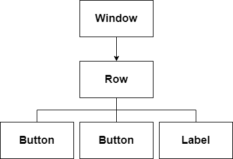
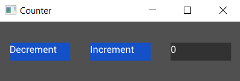
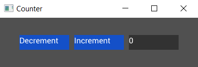

# Composing Widgets

So far our counter has only a single button. Let's add another button and a label, as well as a `Row` widget to be the parent of our buttons and label. A `Row` widget, as the name suggests, lays out its children in a horizontal row:

```rust
extern crate tuix;
use tuix::*;

fn main() {
    let window_description = WindowDescription::new()
        .with_title("Counter")
        .with_inner_size(400, 100);
    let app = Application::new(window_description, |state, window| {
        
        let row = Row::new().build(state, window, |builder| builder);

        Button::with_label("Decrement").build(state, row, |builder| 
            builder
                .set_width(Pixels(100.0))
                .set_height(Pixels(30.0))
                .set_background_color(Color::rgb(20,80,200))
                .set_space(Stretch(1.0))
        );

        Button::with_label("Increment").build(state, row, |builder| 
            builder
                .set_width(Pixels(100.0))
                .set_height(Pixels(30.0))
                .set_background_color(Color::rgb(20,80,200))
                .set_space(Stretch(1.0))
        );

        Label::new("0").build(state, row, |builder| 
            builder
                .set_width(Pixels(100.0))
                .set_height(Pixels(30.0))
                .set_background_color(Color::rgb(50,50,50))
                .set_space(Stretch(1.0))
        );

    });

    app.run();
}
```

Building the second button widget works in the same way as the first. However, notice that the building of both buttons now uses `row` as the parent. This is the `Entity` id of the `Row` widget instance and is returned by its `.build(...)` method. The row uses the `window` as its parent.

Composing these widgets like this forms a tree, where each widget has a single parent and zero or more children. In tuix, this tree is used to propagate events as well as to draw the elements in the correct order. Below is a diagram depicting the current tree of widgets:

<p align="center"></p>

Running this code produces:

<p align="center"></p>

Woah! All our widgets are spaced out across the window! Can you see why?

The default width and height of a widget, if not specified, is to stretch to fill the available space. So the `Row` widget has stretched to fill the window, although we can't see it directly because it has no background color.

The buttons and label all have space around them set to stretch, which results in equal spacing between them, as well as centering them as a collection within the row.

Let's remove the calls to `set_space` on each of the widgets and add two new methods on the builder for the row:

```rs
Row::new().build(state, window, |builder|
    builder
        .set_child_space(Stretch(1.0))
        .set_col_between(Pixels(10.0))
);
```

This sets the space around all of the children of the row (our buttons and label) to stretch, and also sets a fixed horizontal spacing between them of 10 pixels:

<p align="center"></p>

In the nect section we'll add some styling to our app.
