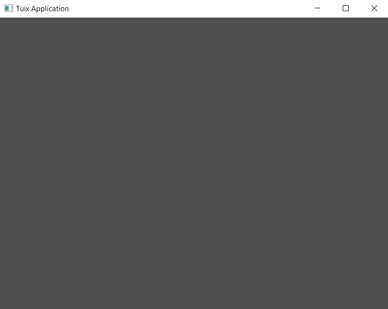

# Creating a Tuix Application

Add the following code to the `main.rs` file:

```rust
extern crate tuix;
use tuix::*;

fn main() {
    let mut app = Application::new(WindowDescription::new(), |state, window| {});

    app.run();
}
```
This is the simplest possible tuix app.

Build and run this code by executing the following command:

```sh
cargo run
```

<p align="center"></p>

You should see an empty gray window appear. Yay! Now to explain what the code does: 

The first argument passed to `Application::new()` is a new instance of a `WindowDescription`. This allows us to set the initial properties of the root window created for us by tuix. Currently, tuix can only create single window applications, but multiwindow is in the works!

The second argument passed to the new method is a closure which provides us with two arguments:

1. `state` - This is a mutable reference to the UI `State`, which represents the 'global' data of the widgets in a gui application, such as layout and style properties. A mutable reference to state is passed around when building widgets, handling events, and drawing widgets.

2. `window` - This is an `Entity` id to the window widget created for us by tuix. Every widget has an entity id which is used with state to modify UI properties.

In the next section we'll cover changing window properties like size, title, and icon.


