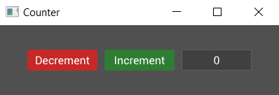

# Creating a Counter Widget

Our code so far produces something that *looks* like it could be a counter but it doesn't do anything yet. In the next section we'll dive into events and how we can use them to add some functionality to the app, but first we need to cover the concept of custom widgets.

So far we've used some of the built-in widgets in tuix to build our app, but it's time to build our own `Counter` widget to contain what we've built so far, and we'll also need it to react to events.

Start by creating a struct called `Counter`, and we'll derive `Default` so we don't need to write a constructor:

```rs
#[derive(Default)]
struct Counter {
    value: i32,
}
```
Our counter contains the actual count value, an `i32`, which we'll need for later.

To make our `Counter` struct a widget we just need to implement the `Widget` trait for it like so:

```rs
impl Widget for Counter {
    type Ret = Entity;
    type Data = ();

    fn on_build(&mut self, state: &mut State, entity: Entity) -> Self::Ret {
        entity
    }
}
```
Let's take a moment to break down the pieces of the `Widget` trait. There are two associated types, `Ret` and `Data`:

- The `Ret` associated type is used to specify what should be returned when the widget is built. Typically a widget will return its `Entity` id, but a widget could be made up of several sub-widgets, some of which the user may need access to when building. In these cases the `Ret` type can be set to a tuple, such as `(Entity, Entity)`. For our counter we'll just return an `Entity`.
- The `Data` associated type is used by the binding system, which for now we will save for a later section of the guide. In the meantime you can set this to `()`.

The `Widget` trait has a few methods, but only the `on_build()` method is required to be implemented, and must return the `Ret` associated type. Usually this will be the entity id of the widget which is passed as an argument to the function.

The `on_build` method is called once when the widget is first built. So when we called `build()` on the buttons and label, their respective `on_build()` methods were called. It is within this function that we can build the components which will make up our widget. Note also that this method provides a mutable reference to `Self`, so we can access fields like our counter value, and a mutable reference to `State`, so we can set inline style properties of the widget at build time, using the `entity` id. 

For the counter, we'll move the row, buttons, and label into the body of this method, making sure to change the parent of the row from `window` to `entity` (the id given to the `Counter` widget when it is built).

```rs
impl Widget for Counter {
    type Ret = Entity;
    type Data = ();

    fn on_build(&mut self, state: &mut State, entity: Entity) -> Self::Ret {

        // Note the change from window to entity
        let row = Row::new().build(state, entity, |builder| 
            builder
                .set_child_space(Stretch(1.0))
                .set_col_between(Pixels(10.0))
        );

        Button::with_label("Decrement").build(state, row, |builder| 
            builder
                .set_width(Pixels(100.0))
                .set_height(Pixels(30.0))
                .class("decrement")
        );

        Button::with_label("Increment").build(state, row, |builder| 
            builder
                .set_width(Pixels(100.0))
                .set_height(Pixels(30.0))
                .class("increment")
        );

        Label::new("0").build(state, row, |builder| 
            builder
                .set_width(Pixels(100.0))
                .set_height(Pixels(30.0))
        );

        entity
    }
}

```

Now that we have a counter widget, which contains our buttons and label, how do we use it? Well, the same as any other widget! Where we had the row, buttons, and label, insert the following line:

```rs
Counter::default().build(state, window, |builder| builder);
```

As with the row widget, the counter by default will fill the available space, and running the code appears to produce the same result as we had before:

<p align="center"></p>

That seemed like a lot of work for no noticeable change. However, it's in the next section that things get interesting for our counter widget.

Also, here is the complete code so far:

```rust
extern crate tuix;
use tuix::*;

const STYLE: &str = r#"

    button {
        border-radius: 3px;
        child-space: 1s;
    }

    button.increment {
        background-color: #2e7d32;
        border-radius: 3px;
    }

    button.increment:hover {
        background-color: #60ad5e;
    }

    button.increment:active {
        background-color: #005005;
    }
    
    button.decrement {
        background-color: #c62828;
        border-radius: 3px;
    }

    button.decrement:hover {
        background-color: #ff5f52;
    }

    button.decrement:active {
        background-color: #8e0000;
    }

    label {
        background-color: #404040;
        border-color: #606060;
        border-width: 1px;
        child-space: 1s;
    }
"#;

#[derive(Default)]
struct Counter {
    value: i32,
}

impl Widget for Counter {
    type Ret = Entity;
    type Data = ();

    fn on_build(&mut self, state: &mut State, entity: Entity) -> Self::Ret {
        let row = Row::new().build(state, entity, |builder| 
            builder
                .set_child_space(Stretch(1.0))
                .set_col_between(Pixels(10.0))
        );

        Button::with_label("Decrement").build(state, row, |builder| 
            builder
                .set_width(Pixels(100.0))
                .set_height(Pixels(30.0))
                .class("decrement")
        );

        Button::with_label("Increment").build(state, row, |builder| 
            builder
                .set_width(Pixels(100.0))
                .set_height(Pixels(30.0))
                .class("increment")
        );

        Label::new("0").build(state, row, |builder| 
            builder
                .set_width(Pixels(100.0))
                .set_height(Pixels(30.0))
        );

        entity
    }
}

fn main() {
    let window_description = WindowDescription::new()
        .with_title("Counter")
        .with_inner_size(400, 100);
    let app = Application::new(window_description, |state, window| {

        state.add_theme(STYLE);
        
        Counter::default().build(state, window, |builder| builder);

    });

    app.run();
}
```
