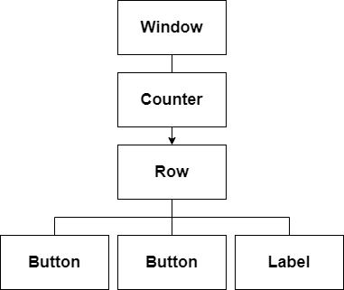
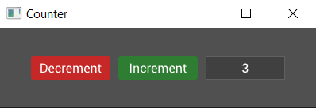

# Events

Alright, we've got a nice looking counter but how do we make it do something? Time for some events!

## Handling Events

The `Widget` trait has another method called `on_event` which will allow us to react to events and change the internal data (the counter value) and child widgets (the buttons and label) of our counter. Add the following to the implementation of the `Widget` trait for our counter, right below the `on_build()` method:

```rs
fn on_event(&mut self, state: &mut State, entity: Entity, event: &mut Event) {

}
```

Note that the method signature is very similar to `on_build` but, instead of returning something, there's an extra argument, a mutable reference to some `Event`.

## Messages

So what is the event? Well an event is a struct which contains a `Message` and some meta data about the event, like its origin and target entities. Okay so what's a `Message`? Well a message is a dynamic object pointer to some user defined type. In fact it can be any type as long as it implements `PartialEq`. So let's make a message type which we can respond to. Add this just before we declare the `Counter` struct:

```rs
#[derive(PartialEq)]
pub enum CounterEvent {
    Increment,
    Decrement,
}
```
Now we can modify the `on_event` method to do something when it receives this type of event:

```rs
fn on_event(&mut self, state: &mut State, entity: Entity, event: &mut Event) {
    if let Some(counter_event) = event.message.downcast() {
        match counter_event {
            CounterEvent::Increment => {
                self.value += 1;
            }

            CounterEvent::Decrement => {
                self.value -= 1;
            }
        }
    }
}

```
Here we attempt to [downcast](https://bennetthardwick.com/rust/downcast-trait-object/) the message within the event to the `ConterEvent` type, and on success match against the options, incrementing or decrementing the counter value in response. 

Okay, so our counter widget can now respond to counter events, but how does it get them? Something needs to send those events. How about those buttons?

## Callbacks

To send events when our buttons are pressed we need another new concept, which is callbacks. Most widgets allow you to set a callback (a closure) which will run when the widget is interacted with or changes state. In this case it's probably best to learn by example so change the decrement button to look like this:

```rs
Button::with_label("Decrement")
    .on_press(|data: &mut Button, state: &mut State, button: Entity|{
        button.emit(state, CounterEvent::Decrement);
    })
    .build(state, row, |builder|
        builder
            .set_width(Pixels(100.0))
            .set_height(Pixels(30.0))
            .class("decrement")
    )
```

For clarity I've included the argument types but these can be inferred by the rust compiler. Notice that the arguments shadow those of `on_build` and the first 3 of `on_event`, providing a mutable reference to the widget (`Button` in this case), a mutable reference to `State`, and the `Entity` id of the button.

Using the button id and state we call `emit()` to send a `CounterEvent::Decrement` event. As the name suggests, this callback will be triggered when the button is pressed.

But where does the event go? Remember that tree which was mentioned before? Well, by default, events are sent *up* the tree, hitting every ancestor on its way to the root (the window). Because the button is a descendant of the counter (counter -> row -> button), the counter will receive the event after the button is pressed. The figure below depicts the tree of widgets with our custom counter widget:

<p align="center"></p>

We're almost there. Adding in the callback for the increment button (left as an exercise for the reader), we now have a counter whose value will change when the buttons are pressed! Hang on though... nothing seems to be happening... the label still shows zero. Ah, we need to make two more modifications to update the label.

First, we need to store the entity id of the label in the counter so we can access it in `on_event`. Change the `Counter` to:

```rs
#[derive(Default)]
struct Counter {
    value: i32,
    label: Entity,
}
```

and then the label to:

```rs
// We now assign the output of the label build to the label variable
self.label = Label::new("0").build(state, row, |builder| 
    builder
        .set_width(Pixels(100.0))
        .set_height(Pixels(30.0))
);
```

Finally, we need to update the label text in the `on_event` method:
```rs
fn on_event(&mut self, state: &mut State, entity: Entity, event: &mut Event) {
    if let Some(counter_event) = event.message.downcast() {
        match counter_event {
            CounterEvent::Increment => {
                self.value += 1;
                self.label.set_text(state, &self.value.to_string());
            }

            CounterEvent::Decrement => {
                self.value -= 1;
                self.label.set_text(state, &self.value.to_string());
            }
        }
    }
}
```
We can set the label this way because every widget has a text property which can be set through its entity id. If this was a more complicated widget, such as a slider, then we would update it using an event targeted at the widget. For example, we could send a `SliderEvent::SetValue()` event to a slider widget to update it.

We finally have a working counter!

You can find the full code for this guide so far in the `examples/counter.rs` file in the tuix repository. Run with `cargo run --release --example counter`. 

<p align="center"></p>

In the next section we'll start to look at how we can make our counter widget more re-usable with some reactivity.