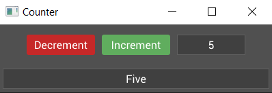

# Lenses and Binding

In the previous section we built some application data near the root of our gui app, but pressing the counter buttons still displays the internal value of our counter widget. 

Let's remove the `on_event` of the `Counter` and the `value` field as well. Now the counter contains no count value, so we need to hook it up to the app data count value instead. 

First, modify the declaration of the `CounterState` struct to add the `Lens` derive macro like so:


```rs
#[derive(Default, Lens)]
struct CounterState {
    value: i32,
}
```

We'll go over lenses and what the `Lens` derive macro is doing in more detail in a moment, but let's take a look at binding our label to the counter value.


## Binding

With the `Lens` derive we can now bind the label in our counter to the value in the counter state with the `bind` method. Change the label to the following:

```rs
self.label = Label::new("0")
    .bind(CounterState::value, |value| value.to_string())
    .build(state, row, |builder| 
        builder
            .set_width(Pixels(100.0))
            .set_height(Pixels(30.0))
    );
```

Let's break down what's going on here. The `bind` method is placed between the creation of the label instance and the call to `build`. It has two arguments, a lens and a closure:

1. The first argument is a lens. We'll cover it in a moment but for now you can think of it as something which 'selects' a piece of a larger structure, in this case the `value` field of the `CounterState` struct.

2. The second argument is a closure which acts as a converter for the lensed data. The counter value is an `i32` but the label expects a `String`, so we use the `.to_string()` method to convert the value to the expected type.

## Lenses

At first glance the lens argument of the `bind()` method seems a bit magical. How are we accessing the value with `CounterState::value`? That doesn't seem like valid rust code. There's a few things going on here which are hidden by the `Lens` derive macro, so let's break it down. 

A lens, at its core, is nothing more than a function which takes some data as input and returns a piece of that data as output, usually as references. In this case it would take an reference to some `CounterState` and return a reference to the `value`. This function is actually a method on a `Lens` trait, which looks something like this:

```rs
pub trait Lens {
    type Source;
    type Target;

    fn view<'a>(&self, data: &'a Self::Source) -> &'a Self::Target;
}
```

The derive macro creates for us a zero-sized static type and then implements this `Lens` trait on it, which might look something like this:

```rs
pub struct SomeGeneratedType;

impl Lens for SomeGeneratedType {
    type Source = CounterState;
    type Target = i32;

    fn view<'a>(&self, data: &'a AppData) -> &'a i32 {
        &data.value
    }
}
```
The other thing that the derive macro does is to create a static instance of the generated type, with the same name as the field (`value`), within a module called `CounterState`. This is what allows us to use `CounterState::value` to refer to the lens.

## Binding Another Label

Now when we run the code we seemingly get the same counter behavior as before. The buttons update the value, via events, and the label receives the new value and updates its display. So why did we do this? Well, now we can do something more interesting, like bind another widget to the same value and display it in a different way, like printing the value as english text. Add the following dependency to the `Cargo.toml` file:

```sh
english-numbers = "0.3.3"
```

Then add a label to the application below the counter with the following `bind` method:

```rs
Label::new("Zero")
    .bind(CounterState::value, |value| english_numbers::convert_all_fmt(*value as i64))
    .build(state, data_widget, |builder| 
        builder
            .set_space(Pixels(5.0))
    );
```
We bind the label to the same value and use the conversion closure to call a method from the `english_numbers` crate to convert the value to an english word. Now when the buttons are pressed to increment and decrement the counter, both labels update to show the value in two different ways!

<p align="center"></p>

In the next section we'll look at how we can make our counter widget more re-usable.

