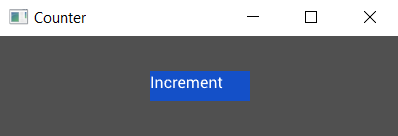

# Positioning the Button

Okay so we have a button, but it's up in the top left when really it should be in the center. If you're coming from web dev then you might be thinking, "oh no, not centering!". But fear not, it's super easy in tuix.

There's actually two ways to center our button, but let's start with one for now, adding stretch space on all sides:

```rust
extern crate tuix;
use tuix::*;

fn main() {
    let window_description = WindowDescription::new()
        .with_title("Counter")
        .with_inner_size(400, 100);
    let app = Application::new(window_description, |state, window| {
            
            Button::with_label("Increment").build(state, window, |builder| {
                builder
                    .set_width(Pixels(100.0))
                    .set_height(Pixels(30.0))
                    .set_background_color(Color::rgb(20, 80, 200))
                    .set_space(Stretch(1.0))
            });
        
        },
    );

    app.run();
}
```
Running this code shows our button now in the ceneter. Easy peasy!

<p align="center"></p>

Hang on though, what the heck is stretch space?

Okay, so while layout in tuix is highly customisable and flexible, it's quite a big topic for a quick start guide. So for now here's a short description, and a more detailed guide can be found the the [layout section](../layout/stack_overview.md).

- Widgets are positioned by their parent into a row, column, or grid with their siblings, determined by parent [layout-type](../layout/stacks.md).
- Widgets can be moved, relative to their stack position, by adding space to each of their sides, [left](../layout/stacks.md), [right](../layout/stacks.md), [top](../layout/stacks.md), and [bottom](../layout/stacks.md), (or [space](../layout/stacks.md) for all four at once).
- Space comes in four varieties:
    - auto - can be overriden by parent
    - stretch - a proportion of the remaining free space
    - percentage - a proportion of the parent width/height
    - pixels - an exact number of pixels
- The parent can apply space to all of its children, if their corresponding space properties are set to auto, using [child-left](../layout/stacks.md), [child-right](../layout/stacks.md), [child-top](../layout/stacks.md), [child-bottom](../layout/stacks.md), or [child-space](../layout/stacks.md). Also specified with the same four possible units.
- The parent can also apply horizontal space between its children, with [col-between](../layout/stacks.md), as vertical space, with [row-between](../layout/stacks.md). All specified with the same for possible units. 

There are more rules but to keep things short the above overview should be sufficient for the rest of this quick-guide.

By adding `stretch` space to each side of the button we are telling tuix to add space which fills the available free space, which causes the button to become centered.

In the next section we'll look at adding more widgets and composing them toegether.