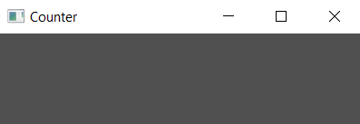

# Setting Window Properties

Window properties can be set using the `WindowDescription`, which is the second argument of the closure passed to `Application::new()`.

Lets add a custom title to our application window. It will eventually be a counter, so let's go with that:

```rust
extern crate tuix;
use tuix::*;

fn main() {
    let app = Application::new(
        WindowDescription::new().with_title("Counter"), 
        |state, window|{}
    );

    app.run();
}
```

Using the builder pattern, setting window properties can be chained together. Let's change the size of the window to just 400 by 100. We don't need all that space for a simple counter:

```rust
extern crate tuix;
use tuix::*;

fn main() {
    let app = Application::new(
        WindowDescription::new().with_title("Counter")
        .with_inner_size(400, 100),
        |state, window|{}
    );

    app.run();
}
```

<p align="center"></p>

To see the full list of window properties that can be set, see the docs page on `WindowDescription`. This will do for now, let's move on to adding widgets to our application.