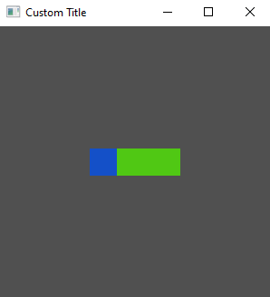

# Widget Styling

As with layout, this quick start guide does not aim to cover all of the intricacies of styling and the properties available. A more comprehensive guide can be found in the [styling section]().

## Inline and Shared Styling

So far we have defined our style properties directly on the widgets using the builder, also known as *inline* styling. Tuix also offers the ability to define style rules to allow *shared* styling between multiple widgets. The widgets affected by these shared style rules are determined by *selectors* which should be familiar to web developers using css and work in the same way.

The following code defines a style rule which acts on any widgets with a class name of `"my_class"`, and also gives this class name to our two widgets:

```rs
use tuix::*;

fn main() {
    let window_description = WindowDescription::new()
        .with_title("Custom Title")
        .with_inner_size(300, 300);

    let app = Application::new(window_description, |state, window| {
    
        // Create a shared style wich applies to all widgets with class name "my_class"
        let style_rule: StyleRule = StyleRule::new()
            .selector(Selector::new().class("my_class"))
            .set_height(Pixels(30.0))
            .set_background_color(Color::rgb(80,200,20));

        // Add the shared style rule to state
        state.add_style_rule(style_rule);

        let container = Element::new().build(state, window.entity(), |builder| 
            builder
                .set_width(Pixels(100.0))
                .set_space_left(Stretch(1.0))
                .set_space_right(Stretch(1.0))
                .set_space_top(Stretch(1.0))
                .set_space_bottom(Stretch(1.0))
                .set_background_color(Color::rgb(20,80,200))

                // Add a class name "my_class"
                .class("my_class")
        );

        Button::new().build(state, container, |builder| 
            builder
                .set_width(Pixels(30.0))

                // Add a class name "my_class"
                .class("my_class")
        );

    });

    app.run();
}
```

Note that the style rule has to be added to the app using `state.add_style_rule()`. Note also that *inline* properties override *shared* properties, so although both widgets are affected by the shared style, the button keeps its blue color as it comes from an inline style rule. The height property, on the other hand, is shared between the two widgets. Below is the output of this code:



## Stylesheets

Tuix also offers the ability to define styles in separate stylesheet files with .css extensions. However, although some of the style properties available in tuix share the same name as css properties, in general the available style properties are different.

We can produce the same shared style as before with the following code in a separate 'theme.css' file:

```css
.my_class {
    height: 30px;
    background-color: #50c814;
}
```

This file can then be included in the binary with the `include_str!` macro and then added to the application with `state.add_theme()` like so:

```rs
use tuix::*;

const THEME: &str = include_str!("path_to_stylesheet/theme.css");

fn main() {
    let window_description = WindowDescription::new().with_title("Custom Title").set_inner_size(300,300);
    let app = Application::new(window_description, |state, window| {
        
        // Add external stylehseet to the application
        state.add_theme(THEME);

        let container = Element::new().build(state, window.entity(), |builder| 
            builder
                .set_width(Pixels(100.0))
                .set_space_left(Stretch(1.0))
                .set_space_right(Stretch(1.0))
                .set_space_top(Stretch(1.0))
                .set_space_bottom(Stretch(1.0))
                .set_background_color(Color::rgb(20,80,200))

                // Add a class name "my_class"
                .class("my_class")


        );

        Button::new().build(state, container, |builder| 
            builder
                .set_width(Pixels(30.0))

                // Add a class name "my_class"
                .class("my_class")
        );

    });

    app.run();
}
```

Alternatively, `state.add_stylesheet()` can be used to add a stylesheet dynamically by specifying the path to the css file. This allows for hot reloading of the stylesheet using the F5 key, however, the css file must be shipped with the executable.