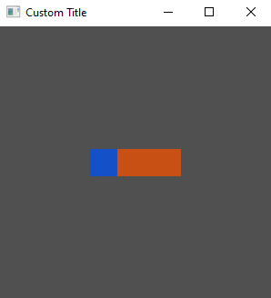

# Widget Layout

Tuix uses the layout properties defined on widgets to position them within the window and to determine their size.

To keep the quick start guide short, we will skip over the details of tuix's layout system. The layout system in tuix is quite comprehensive, and a more detailed guide can be found in the [layout section](https://geom3trik.github.io/tuix-book/section_2_layout/chapter_1.html).

Now, so far we have defined a width and a height for our widgets so now we will position them. The following example positions the element in the center of the window:

```rs
use tuix::*;

fn main() {
    let app = Application::new(|state, window| {
        
        window.set_title("Custom Title").set_inner_size(300,300);

        let container = Element::new().build(state, window.entity(), |builder| 
            builder
                .set_width(Units::Pixels(100.0))
                .set_height(Units::Pixels(30.0))

                // Add stretch spacing to all sides of the element
                .set_space_left(Stretch(1.0))
                .set_space_right(Stretch(1.0))
                .set_space_top(Stretch(1.0))
                .set_space_bottom(Stretch(1.0))

                .set_background_color(Color::rgb(200,80,20))
        );

        Button::new().build(state, container, |builder| 
            builder
                .set_width(Pixels(30.0))
                .set_height(Pixels(30.0))
                .set_background_color(Color::rgb(20,80,200))
        );

    });

    app.run();
}
```




We add space to each side of the element with units of `Stretch(1.0)`. Note, we could have also used `set_space()` to apply the same spacing to all sides. Looking at the horizontal axis, because both `left` and `right` are set to stretch, the layout algorithm splits the free space between them, resulting in equal space either side of the element. The same is done for the verical axis, resulting in a centered element.

Notice also that the button has moved, remaining in the top left corner of the element. This is because widgets are positioned relative to their parents.
